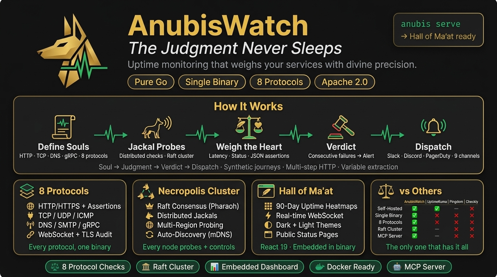

# AnubisWatch

<p align="center">
  
</p>

**The Judgment Never Sleeps**

AnubisWatch is a self-hosted uptime, synthetic monitoring, alerting, and status-page platform written in Go. It ships as a single `anubis` binary with embedded storage, an embedded React dashboard, REST/WebSocket/SSE/gRPC APIs, and optional Raft-backed clustering.

[](https://github.com/AnubisWatch/anubiswatch/actions/workflows/ci.yml)
[](https://github.com/AnubisWatch/anubiswatch/releases)
[](https://goreportcard.com/report/github.com/AnubisWatch/anubiswatch)
[](LICENSE)

## What It Does

- Monitors services as **Souls** and stores each check result as a **Judgment**.
- Supports HTTP, TCP, UDP, DNS, ICMP, SMTP, IMAP, gRPC, WebSocket, and TLS checks.
- Runs multi-step synthetic **Journeys** with assertions and persisted run history.
- Sends alerts through webhook, Slack, Discord, Telegram, email, PagerDuty, OpsGenie, Twilio SMS, and ntfy dispatchers.
- Serves a React 19 + Vite dashboard directly from the Go binary.
- Exposes REST, WebSocket, SSE, gRPC, Prometheus metrics, OpenAPI docs, and MCP endpoints.
- Provides local, OIDC, and LDAP authentication with workspace-aware APIs.
- Includes backup/restore, status pages, maintenance windows, custom dashboards, and audit/security middleware.
- Can run standalone or as a Raft cluster with region-aware probe distribution.

## Terminology

| Term | Meaning |
|------|---------|
| Soul | A monitored target, such as an HTTP endpoint, DNS record, TCP port, or certificate |
| Judgment | A single check execution result |
| Verdict | Alerting decision based on status changes or rule conditions |
| Journey | A multi-step synthetic check |
| Jackal | A probe/controller node |
| Pharaoh | The Raft leader |
| Necropolis | The cluster |
| Feather | The embedded CobaltDB storage engine |
| Duat | The real-time WebSocket/SSE event layer |

## Repository Layout

```text
.
├── cmd/anubis/                 # CLI and server entry point
├── internal/
│   ├── alert/                  # Alert manager and dispatchers
│   ├── api/                    # REST, WebSocket, SSE, metrics, OpenAPI, MCP
│   ├── auth/                   # Local, OIDC, LDAP auth
│   ├── backup/                 # Backup and restore manager
│   ├── cluster/                # Cluster coordination
│   ├── core/                   # Domain models and config
│   ├── dashboard/              # Embedded dashboard assets
│   ├── grpcapi/                # gRPC API server and generated protobuf code
│   ├── journey/                # Synthetic journey executor
│   ├── probe/                  # Protocol checkers
│   ├── raft/                   # Raft node, FSM, discovery, transport
│   ├── statuspage/             # Public status page handler
│   └── storage/                # CobaltDB storage, time series, retention
├── web/                        # React 19 dashboard source
├── configs/                    # JSON/YAML config examples and systemd unit
├── deploy/                     # Docker, Kubernetes, Helm examples
├── docs/                       # API, config, deployment, backup, MCP, WebSocket docs
├── scripts/                    # Release, smoke, preflight, demo scripts
├── Dockerfile
├── docker-compose.yml
└── Makefile
```

## Quick Start

### Build And Run Locally

```bash
git clone https://github.com/AnubisWatch/anubiswatch.git
cd anubiswatch

go mod download
cd web && npm ci && npm run build:embed && cd ..

go build -o bin/anubis ./cmd/anubis
./bin/anubis init
./bin/anubis serve
```

`anubis init` creates `./anubis.json` by default, chooses an available port starting at `8080`, generates a local admin password, and prints the dashboard URL.

### Make Targets

```bash
make build          # Build bin/anubis
make dashboard      # Build and embed the React dashboard
make all            # Build dashboard, then binary
make dev            # go run ./cmd/anubis serve --single --config ./configs/anubis.yaml
make test           # go test -race -coverprofile=coverage.out ./...
make test-short     # go test -short ./...
make lint           # golangci-lint run ./...
make docker         # Build anubiswatch/anubis:<version>
```

### Docker Compose

```bash
export ANUBIS_ADMIN_PASSWORD='change-me-to-a-strong-password'
docker compose up -d
```

The root `docker-compose.yml` builds the local Dockerfile, serves AnubisWatch on `http://localhost:8080`, stores data in the `anubis-data` volume, and mounts `configs/container.anubis.json`.

Cluster and monitoring profiles are also present:

```bash
docker compose --profile cluster up -d
docker compose --profile monitoring up -d
```

### Docker Image

```bash
docker build -t anubiswatch/anubis:local .
docker run --rm -p 8080:8080 \
  -e ANUBIS_ADMIN_PASSWORD='change-me-to-a-strong-password' \
  -v anubis-data:/data \
  anubiswatch/anubis:local
```

The Dockerfile builds the dashboard, compiles `/bin/anubis`, runs as the non-root `anubis` user, reads `/etc/anubis/anubis.json`, and stores runtime data under `/data`.

## CLI

```bash
anubis help
anubis version

anubis init
anubis init --interactive
anubis init --location user
anubis init --output ./anubis-prod.json

anubis serve
anubis serve --single --config ./configs/anubis.yaml
anubis serve --cluster --bootstrap --node-name jackal-01 --region eu-west
anubis serve --cluster --join jackal-01:7946 --node-name jackal-02

anubis watch https://example.com/health --name "Example API" --interval 30s --type http
anubis judge
anubis judge --all
anubis judge "Example API"

anubis souls export --format yaml --output souls.yaml
anubis souls import --replace souls.yaml
anubis souls add monitors.yaml
anubis souls remove example-api

anubis backup create --include-history --output ./backup.json.gz
anubis backup list
anubis backup info anubis_backup_20260115_143022.json.gz
anubis restore ./backup.json.gz --force

anubis config validate
anubis config show
anubis config path
anubis config set server.port 9443

anubis status
anubis health
anubis logs --follow
anubis export souls
anubis export config

anubis necropolis
anubis summon 10.0.0.2:7946 --name jackal-02 --region us-east
anubis banish jackal-02
```

Useful environment variables:

| Variable | Purpose |
|----------|---------|
| `ANUBIS_CONFIG` | Config file path |
| `ANUBIS_HOST` / `ANUBIS_PORT` | HTTP bind host and port |
| `ANUBIS_HTTP_PORT` | Server port override used by `serve` |
| `ANUBIS_DATA_DIR` | Data directory |
| `ANUBIS_ENCRYPTION_KEY` | Enables storage encryption and sets the key |
| `ANUBIS_ADMIN_PASSWORD` | Initial local admin password |
| `ANUBIS_LOG_LEVEL` | `debug`, `info`, `warn`, or `error` |
| `ANUBIS_API_TOKEN` | Token used by CLI commands that call the running API |
| `ANUBIS_NODE_ID` | Cluster node name override |
| `ANUBIS_BIND_ADDR` / `ANUBIS_RAFT_PORT` | Raft bind address/port |
| `ANUBIS_CLUSTER_SECRET` | Cluster shared secret |
| `ANUBIS_CORS_ORIGINS` | Comma-separated CORS allowlist |

## Configuration

Config files can be JSON or YAML. Lookup order is:

1. `ANUBIS_CONFIG`
2. `./anubis.json`
3. `./anubis.yaml`
4. User config path, such as `~/.config/anubis/anubis.json` on Linux
5. System config path, such as `/etc/anubis/anubis.json` on Linux

Minimal YAML example:

```yaml
server:
  host: "0.0.0.0"
  port: 8080
  tls:
    enabled: false

storage:
  path: "./data"

auth:
  type: "local"
  local:
    admin_email: "admin@anubis.watch"
    admin_password: "${ANUBIS_ADMIN_PASSWORD}"

dashboard:
  enabled: true
  branding:
    title: "AnubisWatch"
    theme: "auto"

logging:
  level: "info"
  format: "json"
  output: "stdout"

souls:
  - name: "Example API"
    type: "http"
    target: "https://example.com/health"
    weight: "30s"
    timeout: "10s"
    enabled: true
    http:
      method: "GET"
      valid_status: [200]
```

See [configs/anubis.example.yaml](configs/anubis.example.yaml) and [docs/CONFIGURATION.md](docs/CONFIGURATION.md) for the full schema.

## Monitoring Protocols

| Type | Checker |
|------|---------|
| `http` | HTTP/HTTPS checks with method, headers, status, body, JSON path, redirects, and latency thresholds |
| `tcp` | TCP connection checks with optional banner matching |
| `udp` | UDP send/receive checks |
| `dns` | DNS record checks with resolver lists and propagation options |
| `icmp` | Ping checks with packet count, interval, packet loss, and latency thresholds |
| `smtp` | SMTP server checks with EHLO, STARTTLS, auth, and banner matching |
| `imap` | IMAP server checks |
| `grpc` | gRPC health checks with TLS and metadata options |
| `websocket` | WebSocket connect/send/expect/ping checks |
| `tls` | Certificate expiry, issuer, protocol, OCSP, and key-strength checks |

## APIs And UI

The server exposes:

| Path | Purpose |
|------|---------|
| `/` | Embedded React dashboard |
| `/login` | Dashboard login route |
| `/health` | Liveness check |
| `/ready` | Readiness check |
| `/metrics` | Prometheus-style metrics |
| `/api/docs` | OpenAPI documentation UI |
| `/api/openapi.json` | OpenAPI JSON |
| `/api/v1/*` | Authenticated REST API |
| `/api/v1/mcp` | Authenticated MCP JSON-RPC endpoint |
| `/api/v1/mcp/tools` | MCP tool listing |
| `/ws` | WebSocket event stream |
| `/api/v1/events` | Server-sent events stream |
| `/status`, `/status.html`, `/public/status` | Public status page endpoints |

Dashboard routes include Overview, Souls, Judgments, Alerts, Incidents, Maintenance, Journeys, Cluster, Status Pages, Custom Dashboards, Settings, and Login.

## Cluster Mode

Standalone mode is the default for local development. Cluster mode enables Necropolis/Raft:

```bash
# First node
anubis serve --cluster --bootstrap \
  --node-name jackal-01 \
  --region eu-west \
  --bind 0.0.0.0:7946

# Additional node
anubis serve --cluster \
  --join jackal-01:7946 \
  --node-name jackal-02 \
  --region us-east \
  --bind 0.0.0.0:7946
```

The cluster manager also supports config-driven discovery with `mdns`, `gossip`, or `manual` modes. See [docs/architecture/overview.md](docs/architecture/overview.md) and the `necropolis` section in [configs/anubis.example.yaml](configs/anubis.example.yaml).

## Development

Prerequisites:

- Go matching [go.mod](go.mod), currently `1.25.0`
- Node.js and npm for the dashboard
- Make, Docker, and Docker Compose for the optional helper workflows

Common commands:

```bash
go test ./...
go test -race -coverprofile=coverage.out ./...
go test ./internal/probe -run TestHTTP

cd web
npm ci
npm run dev
npm run build
npm run build:embed
npm run test
npm run e2e
```

The production build path is:

```bash
make dashboard
make build
```

`npm run build:embed` writes the built dashboard into `internal/dashboard/dist` so the Go binary can serve it.

## Deployment

- Dockerfile: [Dockerfile](Dockerfile)
- Docker Compose: [docker-compose.yml](docker-compose.yml)
- Kubernetes manifests: [deploy/k8s](deploy/k8s)
- Helm chart: [deploy/helm/anubiswatch](deploy/helm/anubiswatch)
- Deployment guide: [docs/deployment/guide.md](docs/deployment/guide.md)
- Production runbook: [docs/deployment/production-runbook.md](docs/deployment/production-runbook.md)

Production helper scripts:

```bash
./scripts/production-preflight.sh
./scripts/production-smoke.sh http://localhost:8080
./scripts/capture-deployment-evidence.sh ./evidence
```

## Documentation

- [docs/INDEX.md](docs/INDEX.md)
- [docs/API.md](docs/API.md)
- [docs/CONFIGURATION.md](docs/CONFIGURATION.md)
- [docs/BACKUP.md](docs/BACKUP.md)
- [docs/MCP.md](docs/MCP.md)
- [docs/WEBSOCKET.md](docs/WEBSOCKET.md)
- [ARCHITECTURE.md](ARCHITECTURE.md)
- [docs/adr/README.md](docs/adr/README.md)

## License

AnubisWatch is licensed under the Apache License 2.0. See [LICENSE](LICENSE) for details.

```text
Copyright 2026 Ersin Koc - ECOSTACK TECHNOLOGY OU

Licensed under the Apache License, Version 2.0 (the "License");
you may not use this file except in compliance with the License.
You may obtain a copy of the License at

    http://www.apache.org/licenses/LICENSE-2.0
```
